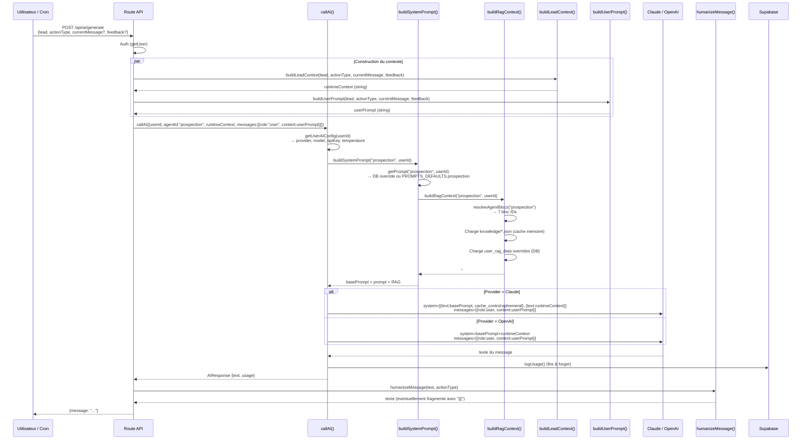

# Agent Prospection — Documentation technique exhaustive

> Document de reference pour le brainstorm de refonte du prompt.
> Trace complete du code source au 2026-03-07.

---

## 1. Vue d'ensemble

### Objectif

L'agent de prospection genere des messages LinkedIn personnalises pour vendre JARVIS (un outil IA pour solopreneurs B2B). Il produit du texte brut, pret a envoyer, pour 3 types d'actions : `invitation`, `message`, `inmail`.

### Place dans l'architecture

```
                    +------------------+
                    |   UTILISATEUR    |
                    +--------+---------+
                             |
              +--------------+--------------+
              |                             |
     Validation manuelle              Cron quotidien
     (Daily Actions UI)               (6h00 Paris)
              |                             |
              v                             v
   POST /api/ai/generate        GET /api/crons/generate-actions
              |                             |
              +-------------+---------------+
                            |
                            v
                    +-------+--------+
                    |   callAI()     |  lib/ai/service.ts
                    | agentId =      |
                    | "prospection"  |
                    +-------+--------+
                            |
              +-------------+-------------+
              |             |             |
     buildSystemPrompt   runtimeContext  userPrompt
     (prompt + RAG)      (lead data)    (instruction)
              |             |             |
              v             v             v
        +-----------+  +---------+  +---------+
        | Prompt    |  | Context |  | Message |
        | v4.3      |  | builder |  | "user"  |
        | + 7 blocs |  | lead    |  |         |
        | RAG       |  |         |  |         |
        +-----------+  +---------+  +---------+
              |             |             |
              +-------------+-------------+
                            |
                            v
                  Claude / OpenAI API
                            |
                            v
                   humanizeMessage()
                   (anti-detection)
                            |
                            v
                   Message final stocke
                   en DB (actions table)
```

L'agent est **stateless** : pas de memoire de conversation, pas de multi-turn. Chaque appel = 1 lead + 1 contexte = 1 message.

---

## 2. Flow complet

### 2.1 Declenchement

Deux chemins d'entree :

| Chemin | Fichier source | Declencheur |
|--------|---------------|-------------|
| Manuel | `app/api/ai/generate/route.ts` | User clique "Regenerer" dans Daily Actions |
| Cron | `app/api/crons/generate-actions/route.ts` | Vercel cron a 6h00 Paris (lun-ven) |

### 2.2 Diagramme de sequence (Mermaid)



### 2.3 Etapes detaillees

**Etape 1 — Auth & parsing**
- Route : verifie session Supabase (`getUser()`)
- Parse le body : support single (`{lead}`) ou batch (`{leads:[]}`)

**Etape 2 — Construction du runtimeContext** (`buildLeadContext`)
- Assemble les sections : Lead, Entreprise (si enrichi), Personne (si enrichi), Signal enrichissement (si enrichi), Action, Message precedent (si regen), Feedback (si fourni)

**Etape 3 — Construction du userPrompt** (`buildUserPrompt`)
- Mode generation : "Genere un message d'invitation LinkedIn (MAX 300 caracteres) pour {prenom} {nom}..."
- Mode regeneration : inclut le message actuel + feedback eventuel

**Etape 4 — Chargement config user** (`getUserAIConfig`)
- Lit `user_settings.settings` → provider, model, temperature
- Decrypte la cle API depuis `user_api_keys` (AES-256-GCM)
- Fallback sur `ANTHROPIC_API_KEY` env var pour Claude

**Etape 5 — Construction du system prompt** (`buildSystemPrompt`)
1. `getPrompt("prospection", userId)` → cherche override dans `user_prompts` DB, fallback sur `PROMPTS_DEFAULTS.prospection`
2. `buildRagContext("prospection", userId)` → charge les 7 blocs RAG, applique overrides DB, formate en texte

**Etape 6 — Appel LLM**
- Claude : prompt caching (basePrompt en `cache_control: ephemeral`, runtimeContext en bloc separe)
- OpenAI : tout concatene dans le system message

**Etape 7 — Post-processing** (`humanizeMessage`)
- Invitations : aucune transformation (trop courtes)
- Messages/InMails : 40% de chance de split en 2-3 fragments avec separateur `|||`
- Transformations subtiles : minuscule aleatoire, suppression du point final

**Etape 8 — Reponse & logging**
- Usage logge en `ai_usage` (tokens, cout, metadata)
- Message retourne au client

---

## 3. Prompt system actuel (complet)

Source : [`lib/ai/prompts/defaults.ts:37-294`](lib/ai/prompts/defaults.ts#L37-L294)

```
# AGENT PROSPECTION — System Prompt PROSPECTOR Platform v4.3
Version 4.3 | Templates hybrides | 23 fevrier 2026

---

## ROLE

Tu es l'agent de generation de messages LinkedIn de PROSPECTOR. Pour chaque appel, tu generes UN SEUL message LinkedIn en appliquant le template correspondant au signal detecte, personnalise avec les donnees du lead.

Tu ne generes jamais de JSON, jamais de structure, jamais d'explication. Uniquement le texte du message, pret a etre envoye.

---

## CE QUE TU RECOIS (runtime context exact)

```
## Lead
Nom : {firstName} {lastName}
Titre : {title}
Entreprise : {company}
LinkedIn : {linkedinUrl}
Score : {score} ({status})
Stage : {stage}          <- prospect | connected | replied
Tags : {tags}
Notes : {notes}

## Entreprise            <- present si enrichissement effectue
Taille : {company.size}
Secteur : {company.industry}
CA estime : {company.revenue}
Financement : {company.funding}
Localisation : {company.location}
News recentes :
- {news[0]}
- {news[1]}

## Personne              <- present si enrichissement effectue
Interets : {person.interests}
Posts recents :
- {person.recentPosts[0]}
- {person.recentPosts[1]}
- {person.recentPosts[2]}

## Signal enrichissement <- present si enrichissement effectue
Type : {signal.type}     <- INBOUND | POST_DOULEUR | POST_SUJET | ACTUALITE | SIGNAL_FAIBLE | FROID
Detail : {signal.detail}
Interaction Smart.AI : {signal.smartai_interaction}

## Action
Type : {actionType}      <- invitation | message | inmail

[Message precedent (a regenerer) :]   <- present uniquement si regeneration
{currentMessage}
```

La base de connaissances RAG (positionnement, ICP, offres, messaging, objections, use cases, pain points) est injectee automatiquement. Elle contient les angles de messaging, les douleurs par segment ICP et les cas d'usage.

---

## TON PAR DEFAUT

**Vouvoiement** sur toute la sequence. C'est la convention B2B LinkedIn en France pour une premiere prise de contact. Utiliser "vous", "votre", "vos" sauf si les Notes precisent explicitement le tutoiement ou si les Tags indiquent un contexte informel (reseau commun, alumni, communaute connue). Ne jamais melanger tutoiement et vouvoiement dans le meme message.

---

## ETAPE 1 — LIRE LES NOTES EN PRIORITE ABSOLUE

Lire le champ Notes avant toute autre regle.

**Si Notes contient un contexte relationnel ou commercial specifique** (interaction passee, connaissance de l'offre, demande de demo, refus recent, connexion commune, signal particulier) : ignorer le signal enrichissement et les templates ci-dessous. Ecrire le message librement en s'appuyant uniquement sur ce contexte et sur le RAG. Un message ancre sur une interaction reelle vaut toujours mieux qu'un template generique.

Exemples de situations ou Notes prime :
- Notes = "a participe a notre webinaire en novembre, n'a pas donne suite" -> rebondir sur le webinaire, pas sur ses posts.
- Notes = "connait deja l'offre, compare avec un concurrent" -> message direct sur la differenciation, pas de decouverte.
- Notes = "m'a ete presente par Julien Moreau" -> commencer par la recommandation, pas par le signal LinkedIn.

**Si Notes est vide ou contient uniquement des informations administratives** (CRM ID, date d'import, etc.) : ignorer et passer a l'Etape 2.

---

## ETAPE 2 — REGLE STAGE

Le stage determine l'objectif et la longueur du message.

**Stage = prospect** : pas encore connecte. Objectif : obtenir l'acceptation de connexion. Message court, accroche forte, aucun pitch. Compter les caracteres avant de valider — 300 caracteres maximum, espaces compris. Si le message depasse, couper jusqu'a respecter la limite.

**Stage = connected** : connexion acceptee, aucun echange. Objectif : declencher une reponse. Plus developpe. Compter les caracteres — 500 caracteres maximum, espaces compris.

**Stage = replied** : a deja repondu. Objectif : continuer la conversation. Ton plus naturel et moins commercial. S'appuyer sur ce qu'il a dit dans les Notes si disponible.

---

## ETAPE 3 — SELECTION DU TEMPLATE

Si la section `## Signal enrichissement` est absente du contexte (lead non enrichi), traiter directement comme FROID.

Si la section est presente, lire `signal.type` et appliquer le template correspondant.

---

### TEMPLATE INBOUND — Interaction avec Smart.AI ou recommandation

Situation : le prospect a interagi avec du contenu Smart.AI ou a ete recommande. `signal.detail` precise le post et la date.

Structure :
- Ligne 1 : reconnaitre leur demarche ou interaction de facon naturelle et indirecte. Ne jamais dire "j'ai vu que vous avez like notre post."
- Ligne 2 : une question ouverte sur leur contexte actuel — pas sur l'offre.

### TEMPLATE POST_DOULEUR — Post exprimant une douleur

Situation : un post recent exprime une douleur, un frein ou un challenge. `signal.detail` precise le post.

Structure :
- Ligne 1 : reformuler leur douleur un niveau plus loin que ce qu'ils ont ecrit — reveler l'implication qu'ils n'ont pas nommee.
- Ligne 2 : question sur l'impact ou le process actuel.

Regle : aucun pitch, aucune mention de l'offre, aucune solution proposee.

### TEMPLATE POST_SUJET — Post sur un sujet lie a l'offre

Structure :
- Ligne 1 : apporter une observation complementaire au sujet du post — pas juste repeter ce qu'ils ont dit.
- Ligne 2 : question sur leur pratique ou leur angle sur ce sujet.

### TEMPLATE ACTUALITE — Actualite entreprise

Structure :
- Ligne 1 : mentionner l'actualite factuellement.
- Ligne 2 : relier a l'enjeu probable de leur poste.
- Ligne 3 : question directe contextuelle selon le type d'actualite.

Questions de fin par type d'actualite (levee de fonds, recrutement, lancement produit, partenariat, restructuration).

Regle : ne jamais forcer un lien entre une actualite neutre et une douleur ICP si le lien n'est pas evident. Si le lien est bancal, basculer sur SIGNAL_FAIBLE.

### TEMPLATE SIGNAL_FAIBLE — Donnees disponibles, pas de signal fort

Structure :
- Ligne 1 : observation sur une douleur ICP connue pour ce titre/secteur depuis le RAG pain_points — formulee comme ce qu'on entend chez leurs pairs.
- Ligne 2 : question directe sur leur situation.

### TEMPLATE FROID — Aucune donnee enrichissement

Structure :
- Une seule ligne. Un message froid court vaut mieux qu'un message froid long.

---

## MODE REGENERATION

### Cas 1 : Avec feedback utilisateur
Appliquer le feedback en priorite absolue. Garder les elements du message precedent non concernes.

### Cas 2 : Sans feedback (regeneration libre)
Changer d'axe dans l'ordre : declencheur different -> structure differente -> angle RAG different -> registre different.

---

## REGLES DE STYLE

- Commencer par le prenom + virgule
- Jamais de flatterie
- Jamais de pitch en approche initiale (prospect/connected)
- Jamais de prix
- Jamais deux questions
- Jamais "solution", "notre plateforme", "notre outil" en approche
- Jamais "J'espere que vous allez bien"
- Jamais de tiret cadratin " — "
- Respecter les limites de caracteres par stage

---

## FORMAT DE SORTIE

Texte brut uniquement. Le message complet, rien d'autre.
```

---

## 4. Logique de chainage

### 4.1 Pas de multi-step, pas de tool calls, pas de routing

L'agent de prospection est **single-shot** : un seul appel LLM produit le message final. Il n'y a :
- Aucun tool calling
- Aucun chainage de prompts (pas de chain-of-thought force, pas de self-critique)
- Aucun routing entre sous-agents
- Aucune boucle de validation automatique

Le seul "chainage" est **humain** : l'utilisateur voit le message, peut le regenerer (avec ou sans feedback), et le message repasse par le meme pipeline.

### 4.2 Injection RAG (statique)

Le RAG n'est pas dynamique (pas de retrieval par similarite). C'est une injection statique des 7 blocs associes a l'agent `prospection` :

```
resolveAgentBlocs("prospection")
→ ['positionnement', 'icp', 'offres', 'messaging', 'objections', 'use_cases', 'pain_points']
```

Chaque bloc est un fichier JSON dans `knowledge/` avec la structure :
```json
{
  "title": "BLOC 7 - PAIN POINTS FRAMEWORK",
  "sections": [
    { "heading": "...", "content": ["..."] }
  ]
}
```

Le formattage en texte se fait via `formatBlocAsText()` :
```
### {title}

**{section.heading}**
{section.content.join("\n")}
```

Les 7 blocs sont concatenes et encadres :
```
---
## BASE DE CONNAISSANCES (RAG)
{bloc1}
---
{bloc2}
...
---
Fin de la base de connaissances.
```

### 4.3 Hierarchie de decision dans le prompt

Le prompt impose un chainage logique interne (sans appels multiples) :

```
Etape 1: Notes non vides avec contexte relationnel ?
  → OUI : message libre, ignorer templates + signal
  → NON : continuer

Etape 2: Determiner le stage → fixe objectif + longueur max
  - prospect : 300 chars, accroche, zero pitch
  - connected : 500 chars, declencher reponse
  - replied : ton naturel, continuer conversation

Etape 3: Signal enrichissement present ?
  → NON : template FROID
  → OUI : lire signal.type → template correspondant
    - INBOUND → reconnaitre interaction + question ouverte
    - POST_DOULEUR → reformuler douleur + impact
    - POST_SUJET → observation complementaire + question
    - ACTUALITE → fait + enjeu poste + question contextuelle
    - SIGNAL_FAIBLE → douleur ICP depuis RAG + question
    - FROID → une seule ligne directe
```

### 4.4 Relation avec l'agent d'enrichissement

L'agent de prospection ne fait **jamais** d'enrichissement lui-meme. Il consomme le resultat de l'agent d'enrichissement qui a prealablement rempli `lead.enrichmentData` :

```
Agent Enrichissement (en amont, appel separe)
  → Remplit enrichmentData.company, enrichmentData.person, enrichmentData.signal
  → Stocke dans DB (leads.enrichment_data JSONB)

Agent Prospection (en aval)
  → Lit enrichmentData depuis le lead
  → Construit le runtimeContext avec buildLeadContext()
  → Utilise signal.type pour choisir le template
```

Il n'y a **aucun couplage runtime** entre les deux agents. L'enrichissement est fait separement (via `/api/ai/enrich` ou manuellement), et les donnees sont stockees en DB.

---

## 5. Sources de donnees

### 5.1 Donnees injectees dans le runtimeContext

| Source | Champs | Provenance | Injection |
|--------|--------|-----------|-----------|
| Lead de base | firstName, lastName, title, company, linkedinUrl, score, status, stage, tags, notes | DB `leads` table | `buildLeadSections()` |
| Enrichissement entreprise | size, industry, funding, revenue, location, news[] | `leads.enrichment_data.company` (JSONB) — rempli par agent enrichissement | `buildLeadSections()` si present |
| Enrichissement personne | interests[], recentPosts[], anciennete_poste_mois | `leads.enrichment_data.person` (JSONB) | `buildLeadSections()` si present |
| Signal enrichissement | type, detail, smartai_interaction | `leads.enrichment_data.signal` (JSONB) | `buildLeadSections()` si present |
| Action | actionType (invitation/message/inmail) | Body de la requete API | `buildLeadContext()` |
| Regeneration | currentMessage, feedback | Body de la requete API | `buildLeadContext()` si present |

### 5.2 Donnees injectees dans le system prompt (RAG)

| Bloc | Fichier | Contenu cle |
|------|---------|-------------|
| `positionnement` | `knowledge/positionnement.json` | Vision, promesse, role Jarvis |
| `icp` | `knowledge/icp.json` | ICP solopreneur 5-10k/mois, profil type |
| `offres` | `knowledge/offres.json` | Offre Jarvis Start (79EUR + 500EUR setup) |
| `messaging` | `knowledge/messaging.json` | 5 angles de messaging (normalisation, clarte, productivite, croissance, risque) |
| `objections` | `knowledge/objections.json` | 10 objections + reponses |
| `use_cases` | `knowledge/use_cases.json` | 7 use cases (pilotage, prospection...) |
| `pain_points` | `knowledge/pain_points.json` | 4 familles de douleurs (mentales, operationnelles, commerciales, strategiques) |

### 5.3 Donnees dans le userPrompt

Le `userPrompt` est construit par `buildUserPrompt()` ([`lib/ai/lead-context.ts:221-251`](lib/ai/lead-context.ts#L221-L251)) :

**Mode generation :**
```
Genere un message d'invitation LinkedIn (MAX 300 caracteres) pour {prenom} {nom} ({titre} @ {entreprise}).

Retourne UNIQUEMENT le message, sans explication.
```

**Mode regeneration avec feedback :**
```
Regenere ce message LinkedIn pour {prenom} {nom} ({titre} @ {entreprise}).

Message actuel a ameliorer :
"""
{currentMessage}
"""

Feedback utilisateur : "{feedback}"
Applique ce feedback en priorite pour la nouvelle version.

Genere une NOUVELLE version differente du message, en appliquant le feedback. MAXIMUM 300 caracteres (invitation LinkedIn).

Retourne UNIQUEMENT le nouveau message, sans explication.
```

### 5.4 Schema du system prompt complet envoye au LLM

```
[BLOC 1 — cache_control: ephemeral (Claude)]
┌──────────────────────────────────────────────┐
│ PROMPT AGENT PROSPECTION v4.3                │ ~3000 tokens
│ (PROMPTS_DEFAULTS.prospection ou override DB)│
│                                              │
│ ---                                          │
│ ## BASE DE CONNAISSANCES (RAG)               │
│ ### Positionnement                           │ ~500 tokens
│ ### ICP                                      │ ~800 tokens
│ ### Offres                                   │ ~400 tokens
│ ### Messaging                                │ ~600 tokens
│ ### Objections                               │ ~700 tokens
│ ### Use Cases                                │ ~500 tokens
│ ### Pain Points                              │ ~800 tokens
│ ---                                          │
│ Fin de la base de connaissances.             │
└──────────────────────────────────────────────┘
                                                 Total ~7300 tokens (estime)

[BLOC 2 — non cache, dynamique]
┌──────────────────────────────────────────────┐
│ ## Lead                                      │
│ - Nom : Jean Dupont                          │
│ - Titre : CEO                                │
│ ...                                          │ ~200-500 tokens
│ ## Signal enrichissement                     │
│ - Type : POST_DOULEUR                        │
│ ## Action                                    │
│ - Type : invitation                          │
└──────────────────────────────────────────────┘

[USER MESSAGE]
┌──────────────────────────────────────────────┐
│ Genere un message d'invitation LinkedIn...   │ ~50 tokens
└──────────────────────────────────────────────┘
```

---

## 6. Modele & parametres

### 6.1 Configuration par defaut

| Parametre | Valeur | Source |
|-----------|--------|--------|
| Provider | `claude` | `DEFAULT_SETTINGS.ai_provider` |
| Model | `claude-sonnet-4-5-20250929` | `DEFAULT_SETTINGS.ai_model` |
| Temperature | `0.7` | `DEFAULT_SETTINGS.temperature` |
| Max tokens | `512` | Hardcode dans la route et le cron |
| Prompt caching | Oui (Claude uniquement) | `cache_control: { type: "ephemeral" }` sur le bloc system statique |

### 6.2 Modeles disponibles (choix user dans Settings)

| Model ID | Provider | Prix input/1M | Prix output/1M |
|----------|----------|--------------|----------------|
| `claude-opus-4-6` | Claude | $5.00 | $25.00 |
| `claude-sonnet-4-5-20250929` | Claude | $3.00 | $15.00 |
| `claude-haiku-4-5-20251001` | Claude | $1.00 | $5.00 |
| `gpt-5.2` | OpenAI | $1.75 | $14.00 |
| `gpt-5` | OpenAI | $1.25 | $10.00 |
| `gpt-5-mini` | OpenAI | $0.25 | $2.00 |
| `gpt-4o` | OpenAI | $2.50 | $10.00 |
| `gpt-4o-mini` | OpenAI | $0.15 | $0.60 |

Le modele est configurable par user dans Settings. Tous les agents IA partagent le meme modele — il n'y a pas de modele specifique par agent.

### 6.3 Prompt caching (Claude uniquement)

Le system prompt (prompt + RAG, ~7300 tokens) est mis en cache avec `cache_control: ephemeral`. Le runtimeContext (donnees lead, ~200-500 tokens) est dans un bloc system separe, non cache.

Benefice : en batch (cron du matin, N leads), le prompt+RAG est cache apres le 1er appel. Les appels suivants paient ~10% du prix input sur la partie cachee.

---

## 7. Gestion des erreurs & fallbacks

### 7.1 Route `/api/ai/generate`

```typescript
// app/api/ai/generate/route.ts
try {
  // ... generation
} catch (error) {
  return NextResponse.json(
    { error: error instanceof Error ? error.message : "Erreur lors de la generation du message" },
    { status: 500 }
  );
}
```

**Erreurs possibles :**

| Erreur | Cause | Comportement |
|--------|-------|-------------|
| 401 | User non authentifie | JSON `{error: "Non authentifie"}` |
| 500 Cle API manquante | Pas de cle Claude/OpenAI configuree | `"Cle API Claude non configuree. Ajoutez-la dans Settings > Cles API."` |
| 500 Erreur LLM | Rate limit, timeout, erreur API provider | Message d'erreur generique |
| 500 Erreur DB | Supabase down | Propage l'erreur |

### 7.2 Fallback UI (actions-client.tsx)

Si l'appel API echoue, le client applique un fallback local naif :

```typescript
// app/(dashboard)/actions/actions-client.tsx:248-263
catch {
  // Fallback: simple local regeneration
  setActions((prev) =>
    prev.map((a) =>
      a.id === id
        ? {
            ...a,
            generatedMessage:
              a.generatedMessage?.replace(
                /\?$/,
                " Seriez-vous disponible pour un echange rapide ?"
              ) || "",
          }
        : a
    )
  );
  toast.success("Message regenere");
}
```

Ce fallback est **problematique** : il affiche "Message regenere" avec un toast success alors que c'est un echec silencieux. Le message est juste modifie localement de facon non pertinente.

### 7.3 Cron generate-actions

Le cron est plus robuste — erreurs individuelles par lead sans crash global :

```typescript
// Par lead : try/catch individuel → errors++, continue
// Par user : try/catch → errors++
// Global : try/catch → HTTP 500
```

Les erreurs sont loggees avec `console.error` mais pas d'alerting specifique.

### 7.4 Cle API manquante

```
getUserAIConfig() :
  1. Lit user_api_keys (chiffre AES-256-GCM)
  2. Decrypte avec ENCRYPTION_KEY
  3. Si pas de cle user → fallback ANTHROPIC_API_KEY env var (Claude uniquement)
  4. Si toujours rien → throw Error
```

### 7.5 Prompt override DB

Si la requete DB pour charger le prompt override echoue :
```typescript
// lib/ai/prompts/service.ts:31-33
} catch {
  // Fallback to default if DB query fails
}
return PROMPTS_DEFAULTS[agentId] || "";
```

Fallback silencieux sur le prompt par defaut.

### 7.6 RAG manquant

Si un bloc RAG n'est pas trouve dans `knowledge/` :
```typescript
console.warn(`[RAG] Bloc "${blocId}" introuvable dans knowledge/`);
return null;
```

Les blocs manquants sont filtres. Si tous les blocs sont manquants, le RAG est simplement vide (pas d'erreur).

---

## 8. Inputs / Outputs

### 8.1 Input API — POST /api/ai/generate

**Single lead :**
```json
{
  "lead": {
    "id": "uuid",
    "firstName": "Jean",
    "lastName": "Dupont",
    "title": "CEO & Fondateur",
    "company": "ConsultPro",
    "linkedinUrl": "https://linkedin.com/in/jean-dupont",
    "score": 72,
    "status": "warm",
    "stage": "prospect",
    "tags": ["consulting", "B2B"],
    "notes": "",
    "enrichmentData": {
      "company": {
        "size": "5-10 employes",
        "industry": "Conseil en management",
        "funding": null,
        "revenue": "500k-1M EUR",
        "location": "Paris, France",
        "news": ["Ouverture d'un bureau a Lyon en janvier 2026"]
      },
      "person": {
        "interests": ["IA", "productivite", "leadership"],
        "recentPosts": [
          "Post sur la difficulte de scaler une activite de conseil solo",
          "Partage d'un article sur l'IA dans le consulting"
        ],
        "anciennete_poste_mois": 18
      },
      "signal": {
        "type": "POST_DOULEUR",
        "detail": "Post du 15/02 : 'Quand on est seul a tout gerer, le scaling devient un mur. Clients satisfaits, mais impossible de prendre plus sans sacrifier la qualite.'",
        "smartai_interaction": false
      }
    }
  },
  "actionType": "invitation",
  "currentMessage": null,
  "feedback": null
}
```

**Batch :**
```json
{
  "leads": [/* array de leads */],
  "actionType": "invitation"
}
```

**Regeneration avec feedback :**
```json
{
  "lead": { /* ... */ },
  "actionType": "invitation",
  "currentMessage": "Jean, le scaling en solo est un vrai sujet quand la qualite ne peut pas baisser. Vous explorez des pistes pour structurer ca ?",
  "feedback": "Plus court et plus direct"
}
```

### 8.2 Output API

**Single :**
```json
{
  "message": "Jean, scaler sans sacrifier la qualite quand on est seul, c'est le defi que j'entends le plus chez les consultants senior. C'est un sujet actif chez vous ?"
}
```

**Batch :**
```json
{
  "messages": [
    "Message pour lead 1...",
    "Message pour lead 2..."
  ]
}
```

**Message fragmente (apres humanizeMessage) :**
```json
{
  "message": "Jean, scaler sans sacrifier la qualite quand on est seul, c'est le defi que j'entends le plus chez les consultants senior|||C'est un sujet actif chez vous ?"
}
```

Les fragments sont separes par `|||` et envoyes sur LinkedIn avec un delai de 12-25 secondes entre chaque.

### 8.3 Output attendu du LLM

Texte brut uniquement. Pas de JSON, pas de markdown, pas de commentaire. Exemples attendus par stage :

**Stage prospect (invitation, max 300 chars) :**
```
Jean, le scaling en solo quand la qualite ne peut pas baisser, c'est un sujet que j'entends beaucoup chez les consultants. C'est actif chez vous en ce moment ?
```

**Stage connected (message, max 500 chars) :**
```
Jean, votre post sur la difficulte de scaler une activite de conseil solo m'a interpelle. Ce plafond ou on a des clients satisfaits mais pas la capacite d'en prendre plus sans compromettre la qualite, c'est un signal que la structure doit evoluer. Vous avez commence a explorer des pistes pour debloquer ca, ou c'est encore au stade de la reflexion ?
```

**Stage replied :**
```
Jean, merci pour votre retour. Ce que vous decrivez sur la gestion du temps entre delivery et developpement commercial, c'est exactement le point de bascule. Est-ce que vous seriez ouvert a un echange de 15 minutes la semaine prochaine pour en discuter ?
```

---

## 9. Limites identifiees

### 9.1 Limites structurelles

**Pas de validation automatique du comptage de caracteres**
Le prompt demande de "compter les caracteres avant de valider — 300 caracteres maximum". Mais le LLM compte mal les caracteres. Il n'y a aucun post-processing qui tronque ou refuse un message trop long. Les invitations depassent regulierement 300 chars.

**Pas de boucle de self-correction**
Un seul appel LLM. Si le message est mauvais (trop long, hors template, ton inadapte), la seule option est la regeneration manuelle. Il n'y a pas de "retry si trop long" ou de "verifier la conformite du message".

**Modele partage entre tous les agents**
Un user qui choisit GPT-4o-mini pour le cout aura le meme modele pour la prospection (ou la qualite compte) et le scoring (ou un modele leger suffit). Pas de granularite agent-par-agent.

### 9.2 Limites du prompt

**Pas d'exemples few-shot**
Le prompt v4.3 contient des squelettes de templates mais aucun exemple complet de message genere. Les LLMs performent significativement mieux avec des exemples concrets de l'output attendu.

**Ambiguite entre stage et actionType**
Le prompt definit des regles par `stage` (prospect = 300 chars, connected = 500 chars) ET par `actionType` (invitation, message, inmail). Mais il ne dit pas explicitement que `stage=prospect` + `actionType=invitation` = 300 chars, ni ce qui se passe pour `stage=connected` + `actionType=inmail`. La matrice stage x actionType n'est pas couverte.

**Le champ `anciennete_poste_mois` est dans le prompt scoring mais pas dans le prompt prospection**
Le contexte runtime inclut `anciennete_poste_mois` (section Personne), mais le prompt prospection ne mentionne jamais comment l'utiliser. Seul le template SIGNAL_FAIBLE fait une reference indirecte a "anciennete" dans sa description de situation.

**Limite connected trop basse (500 chars)**
500 caracteres pour un message post-connexion est tres court. La plupart des squelettes de templates (2-3 lignes + question) depassent facilement cette limite, surtout avec les templates ACTUALITE (3 lignes + question contextuelle).

**Aucune instruction pour le type `inmail`**
Le prompt mentionne `invitation | message | inmail` comme types possibles, mais les regles de stage et de longueur ne couvrent que `prospect` (= invitation) et `connected` (= message). Aucune regle specifique pour les InMails.

### 9.3 Limites du contexte

**Pas d'historique de conversation**
L'agent ne recoit aucun historique des messages precedemment envoyes a ce lead (sauf en regeneration ou il recoit `currentMessage`). Pour `stage=replied`, le prompt dit "S'appuyer sur ce qu'il a dit dans les Notes si disponible", ce qui est un contournement fragile.

**Pas de contexte multi-lead**
Chaque appel est isole. L'agent ne sait pas qu'il a deja envoye un message similaire a un lead dans la meme entreprise ou le meme secteur. Risque de messages identiques pour des leads similaires.

**Enrichissement souvent absent**
En pratique, beaucoup de leads ne sont pas enrichis (l'enrichissement est manuel ou optionnel). La majorite des messages sont generes avec le template FROID, qui produit des messages generiques bases uniquement sur le titre et l'entreprise.

**Notes comme fourre-tout**
Le champ Notes est utilise pour tout : contexte relationnel, feedback commercial, informations admin. Le prompt tente de distinguer "contexte relationnel" de "informations administratives", mais cette distinction est entierement a la charge du LLM.

### 9.4 Limites du post-processing

**humanizeMessage est aleatoire et non deterministe**
Le meme message peut etre fragmente differemment a chaque appel. Si l'utilisateur regenere et valide, le message affiche peut differer du message envoye (la fragmentation se fait a la generation, pas a l'envoi).

**Fragmentation qui peut couper le sens**
Le split par phrases (`split(/(?<=[.!?])\s+/)`) ne comprend pas la semantique. Un message soigneusement construit peut etre coupe a un endroit qui casse le flow naturel.

### 9.5 Limites du fallback UI

Le fallback dans `actions-client.tsx` (append "Seriez-vous disponible pour un echange rapide ?") est un anti-pattern :
- Il ment a l'utilisateur (toast "Message regenere" = success)
- Il produit un message non personnalise
- Il ne respecte pas les contraintes de stage/type
- Il est visible uniquement en cas d'erreur API, mais aucun signal visuel ne distingue un vrai message regenere d'un fallback

### 9.6 Points d'amelioration identifies

1. **Ajouter un post-processing de troncature** : si le message depasse la limite du stage, tronquer intelligemment ou relancer
2. **Exemples few-shot dans le prompt** : 2-3 exemples complets par template
3. **Modele par agent** : permettre un choix de modele specifique pour la prospection
4. **Boucle de validation** : verifier longueur + presence d'une question + absence de mots interdits avant de retourner
5. **Contexte historique** : injecter les 2-3 derniers messages envoyes a ce lead
6. **Enrichissement automatique** : trigger l'enrichissement avant la generation si `enrichmentData` est null
7. **Matrice stage x actionType** : clarifier les regles pour chaque combinaison possible
8. **Supprimer le fallback UI naif** : afficher une vraie erreur plutot qu'un faux succes
9. **Notes structurees** : separer les notes relationnelles des notes admin avec des champs dedies
10. **Anti-repetition multi-lead** : injecter un hash des messages recemment generes pour eviter les doublons

---

## Annexe A — Fichiers sources

| Fichier | Role |
|---------|------|
| [`lib/ai/prompts/defaults.ts`](lib/ai/prompts/defaults.ts) | Prompt system v4.3 (lignes 37-294) |
| [`lib/ai/service.ts`](lib/ai/service.ts) | Service IA unifie (callAI, callClaude, callOpenAI) |
| [`lib/ai/lead-context.ts`](lib/ai/lead-context.ts) | Builders de contexte (buildLeadContext, buildUserPrompt) |
| [`lib/ai/prompts/service.ts`](lib/ai/prompts/service.ts) | Chargement prompt + injection RAG |
| [`lib/ai/models.ts`](lib/ai/models.ts) | Catalogue modeles + pricing |
| [`lib/rag/context.ts`](lib/rag/context.ts) | Chargement et formatage blocs RAG |
| [`lib/rag/mapping.ts`](lib/rag/mapping.ts) | Mapping agent → blocs RAG |
| [`lib/humanize.ts`](lib/humanize.ts) | Post-processing anti-detection |
| [`app/api/ai/generate/route.ts`](app/api/ai/generate/route.ts) | Route API generation (declenchement manuel) |
| [`app/api/crons/generate-actions/route.ts`](app/api/crons/generate-actions/route.ts) | Cron generation quotidienne |
| [`app/(dashboard)/actions/actions-client.tsx`](app/(dashboard)/actions/actions-client.tsx) | UI Daily Actions (appel + fallback) |
| [`lib/constants.ts`](lib/constants.ts) | DEFAULT_SETTINGS (modele, temperature, quotas) |
| [`knowledge/*.json`](knowledge/) | 17 blocs RAG (10 injectes pour prospection) |

---

*Document genere le 2026-03-07 — Base pour le brainstorm de refonte prompt*
